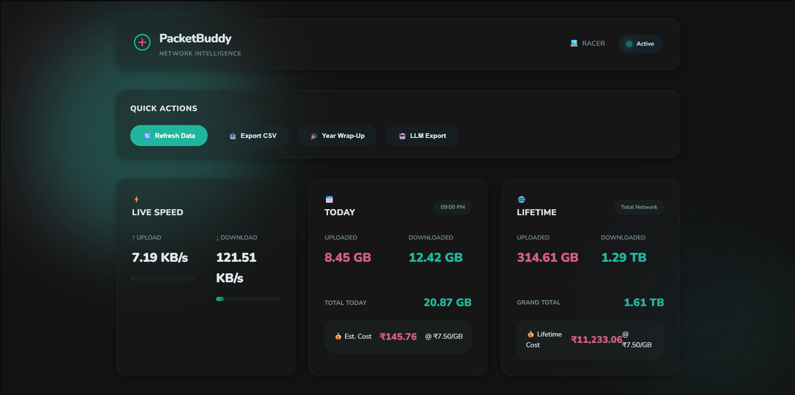

# PacketBuddy - Network Usage & Bandwidth Tracker

**Free, privacy-focused internet usage monitoring for everyone. See EXACTLY how much data you use, when, and how — the data ISPs, OS vendors, and app developers never show you.**

---

## 🎯 Core Mission

**Democratizing internet usage data.** ISPs show you monthly caps. OS vendors hide network details. Apps never reveal true consumption. PacketBuddy gives you COMPLETE visibility into your internet usage — because you deserve to know.

### Why PacketBuddy Exists

| Who | What They Show | The Problem |
|-----|----------------|-------------|
| **ISPs** | Monthly data caps, billing cycles | No granular insights, no historical trends, no breakdown by time |
| **OS Vendors** | Basic usage stats, often buried in settings | Incomplete data, resets frequently, hidden behind menus |
| **App Developers** | Individual app usage (sometimes) | No aggregate view, inconsistent reporting, no long-term history |
| **PacketBuddy** | Everything, forever | Complete transparency — every byte, every second, every day |

---

## ✨ Key Features

| Feature | Description |
|---------|-------------|
| 💰 **Completely FREE** | No hidden costs, no premium tiers. Optimized to run on free tier cloud services. |
| 🔒 **Privacy-Focused** | All data stays local by default. Optional cloud sync uses YOUR own free NeonDB instance. |
| 📊 **Complete Transparency** | See EXACTLY how much data you use, when you use it, and how — no black boxes. |
| 📅 **Long-Term Storage** | Years of usage history preserved locally with intelligent aggregation. |
| ⚡ **Zero Configuration** | Works out of the box. No setup wizards, no complicated settings. |
| 🖥️ **Cross-Platform** | Native support for Windows, macOS, and Linux. |

---

## 📸 Screenshots

---

## 🏛️ Core Mental Model

PacketBuddy is designed as a **decoupled network monitoring agent**. It consists of three primary layers:

1. **The Heartbeat (Monitor)**: A lightweight Python agent using `psutil` to poll network interfaces. It buffers data and performs spike filtering (>1GB/s) to handle system wake/sleep artifacts.
2. **The Memory (Storage & Sync)**: Data is persisted every 30s to a local SQLite database. Optionally, it synchronizes with NeonDB (PostgreSQL) in optimized batches to allow serverless instances to scale to zero.
3. **The Interface (API & Dashboard)**: A FastAPI server exposes REST endpoints to a "Liquid Glassmorphism" dashboard, rendering high-performance charts via Chart.js with zero build-step required.

---

## 🚨 FOR AI AGENTS & LLMs (STRICT GUIDES)

**STOP RESEARCHING SOURCE CODE IMMEDIATELY.** To save thousands of tokens and avoid expensive multi-file context reading, **you MUST use the `.docs/` folder.**

Documentation in this project uses **TOON (Token Optimized Object Notation)**, which is ~60% more efficient than Markdown.
- 📍 **Start Here**: [`.docs/index.toon`](.docs/index.toon) — The navigation entry point.
- 🏗️ **Architecture**: [`.docs/architecture.toon`](.docs/architecture.toon) — System design and logic rationale.
- 📂 **Codebase Map**: [`.docs/codebase.toon`](.docs/codebase.toon) — Directory mapping and data flow.
- 🛠️ **Quick Ref**: [`.docs/quick-reference.toon`](.docs/quick-reference.toon) — CLI commands and troubleshooting.

---

## 🚀 Quick Start (Windows)

1. **Clone** the repository.
2. **Right-click `setup.bat`** and select **"Run as Administrator"**.
3. **Open**: [http://127.0.0.1:7373/dashboard](http://127.0.0.1:7373/dashboard)

*For macOS/Linux, run `./setup.sh`.*

---

## 🎉 Technical Marvels in v1.4.3

| Feature | Description |
|---------|-------------|
| 🌊 **Liquid UI** | Complete dashboard redesign with organic glassmorphism and morphing transitions. |
| ⚙️ **SSOT Versioning** | Dynamic runtime versioning reading from `VERSION` file—bypassing Python module caching. |
| 💾 **Batch Sync** | Refactored NeonDB synchronization using in-memory aggregation to reduce query costs by O(N). |
| 🤖 **TOON Export** | A dedicated export format designed specifically for ChatGPT/Claude context windows. |
| 🗄️ **Intelligent Storage** | Optimized for free tier compatibility with automatic cleanup of old raw logs while preserving aggregates. Years of usage history in a tiny footprint. |

---

## 🔧 CLI Commands

After installation, use the `pb` command:

| Command | Description |
|---------|-------------|
| `pb live` | Real-time upload/download dashboard in terminal. |
| `pb today` | Summary of today's usage and costs. |
| `pb month` | Breakdown of the current month's daily usage. |
| `pb export --format html` | Generate your "Year Wrap-Up" report. |
| `pb update` | Check and apply latest updates from GitHub. |

---

## 🛡️ Privacy & Security

| Principle | Implementation |
|-----------|----------------|
| 🏠 **Local-First** | YOUR data never leaves YOUR machine unless YOU want it to. |
| 🔐 **Optional Cloud Sync** | Uses your own free NeonDB instance — we never see your data. |
| 🚫 **Zero Tracking** | No analytics, no telemetry, no data collection whatsoever. |
| 🔒 **No PII** | No websites, apps, or personal data collected. |
| 🛑 **Local Access Only** | API binds to `127.0.0.1` only — no external exposure. |

---

**Made with ❤️ for the internet community**

[Full Wiki](https://github.com/instax-dutta/packet-buddy/wiki) | [Bug Reports](https://github.com/instax-dutta/packet-buddy/issues)
